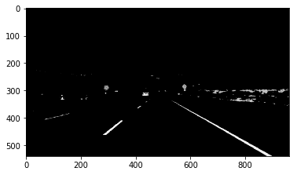
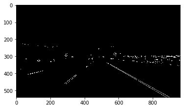
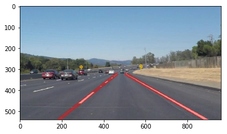

# **Finding Lane Lines on the Road** 

## Introduction

The main goal of this project is to detect and identify the lane lines with high accuracies for some real video streams. The challenges is to extract those lane lines and identify them without any external distortions from the surrounding. This project is programmed using Python and OpenCV library for Image processing and Computer vision. This document will describe the pipeline of the code implementation and will share some reflections on how it was successfully executed.

### Reflection

### 1. Pipeline Description. 

**Images Conversion from RGB to HLS**

The proposed pipeline in this work consists of 6 steps. First, the images were transformed from RGB to HLS to get all the colors with high Lightness (above 200) which means in the high brightness region such as the White lane lines. The Yellow lanes were however detected with less Lightness but Hue values in the range between 10 and 40 and Lightness above 100. The two image masks for the white and yellow colors are then added together (Bitwise OR) and the "select_white_yellow" function returns the image with only both colors.

*Figure 1: White and Yellow Lane Colors in HLS*

**Modifications on draw_lines() function**

In fact we assume that the camera angle and optical zoom is fixed, hence we predict to have the lane lines drawn from the Hough transform within a limited predictable area and slopes. The "draw_lines(...)" function takes the image, the Hough lines, Result Line Color and thickness as its parameters. First, we get the resolution of the image first (image.shape), then for each line with (x1,y1,x2,y2) the slope is calculated and checked. If the slope is greater than Zero and x1 & x2 are greater than half the X-Resolution (image width/2), then the points are added to the Right Lane Rx and Ry data arrays, else if slope is less than zero and x1 & x2 are less than half the resolution, then the points are added to the Left Lane Lx and Ly data arrays. Then the function "cv2.polyfit(...)" is used to fit the Right and Left Lane lines respectively and draw only a first degree order line for each lane using the function "cv2.line(...)".

*Example*

Lxdata = [290, 451, 281, 333, 294, 452, 281, 450, 289, 419, 337, 416, 292, 452]

Lydata = [462, 332, 462, 419, 461, 333, 460, 332, 462, 357, 416, 356, 462, 332]

Rxdata = [530, 878, 532, 897, 530, 897, 530, 877, 609, 777]

Rydata = [337, 538, 336, 538, 336, 539, 338, 538, 382, 479]

**Main Running Code Implementation**

1. Image is transformed from RGB to the HLS, then the Yellow and White image masks are added together (Bitwise OR).

2. Grayscale conversion
3. Gaussian Smoothing (Blurring image before applying the Canny edge detector filter)
4. Apply the Canny Edge Detector filter with Low and High Thresholds of 60 and 100 respectively.

5. Apply the Region of Interest function with the vertices of a Polygon-shaped mask to define the area of the lanes in the image.
6. Apply the Hough Transform on the resulted image (Edge detected image with ROI) to get the possible lines.
7. Apply the draw_lines(..) function to draw a final averaged thick line for each lane from the Hough lines.
8. Apply the weighted_img() function to make the final lines semi transparent over the original photo.

### 2. Potential shortcomings

The transformation from the RGB to the HLS domain, then bitwising the White and yellow images made a huge and extremely effective improvement to the detection of the lane lined with a huge accuracy of around 100% on all the given samples including the Challenge problem. However, this project still assumes that there are no obstacles (i.e. other cars) close to the vehicle's front view which would cause some occulusions. Also it was assumed that the weather conditions are clear. Of course, the HLS domain overcame the challenge of different brightness due to shadows or different weather conditions which made the implementation very robust.

A possible shortcoming would appear with more curvy lane lines as well, which would make the hough transform with the given set parameters produce less lines or possibly would not be identified as lines. 

### 3. Suggest possible improvements to your pipeline

A possible improvement for the curvy lane lines would be to use higher order fitting polynomial to follow the lane curvature, but this would be a challenge as well since it will consume more computational time.

